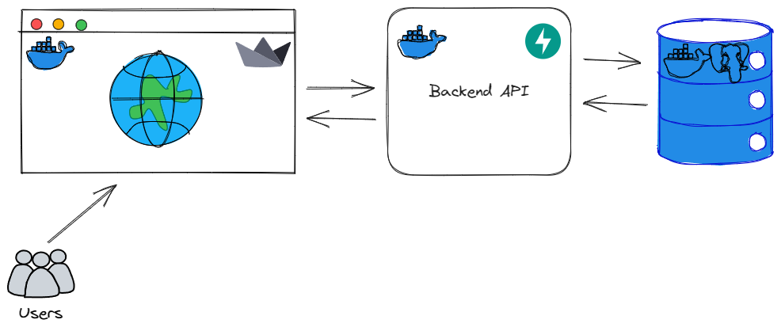

# TaskManager

A project management web app built with FastAPI and Streamlit, allowing users to create, manage, and collaborate on projects, tasks, and teams.

## Main Features

- User authentication
- Project and task creation, updates, and deletion
- Team collaboration with role-based access control

<p align="center">
  
</p>

## Getting Started

1. **Clone the Repository:**
    - First off, you need to clone the repository to your local machine. You can do this with the following command:
    ```bash
    git clone https://github.com/EASS-HIT-PART-A-2022-CLASS-III/TaskManager.git
    ```
2. **Navigate to the project directory:**
    - Once cloned, navigate into the project directory with the following command:
    ```bash
    cd TaskManager
    ```
3. **Start the Docker Containers:**
    - Make sure you have Docker installed on your machine. start the containers by running:
    ```bash
    docker-compose up
    ```
    Now, you can go to your web browser and type in http://localhost:8501 to access the application. 
    The API documentation is available at http://localhost:8000/docs.

### Run Tests
1. **Check if the Docker containers are running:**
    - Open your terminal or command prompt and enter the following command to check the status of the Docker containers:
    ```bash
    docker ps
    ```
    - This will display a list of running containers. Make sure that the TaskManager containers are up and running.
2. **Run the script**
    - In the TaskManager directory, there should be a script named run_tests.sh. Execute this script using the following command:
    ```bash
    ./run_tests.sh
    ```
